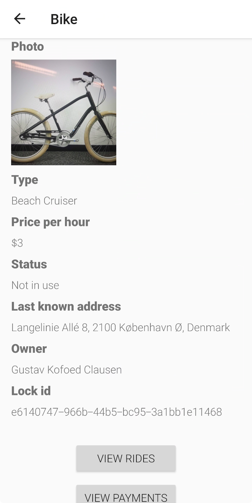

# BikeShare
BikeShare is an Android app that enables sharing bicycles among a community of users in Copenhagen. The user is able to register bicycles for others to rent,  rent bicycles themselves, and manage their user account. Furthermore, the app is intended for an environment where the bicycles are locked with a special lock that identifies the bicycle, and that can be locked and unlocked using Bluetooth. This functionality is however left out of this version, and is replaced with a mock implementation.  

This project is the final assignment in the course, Mobile App Development, taught on IT-University of Copenhagen in Spring 2019.

Feel free to use the source code in any way you like 🙏 This project is solely done for demonstration and educational purposes.

## Screenshots

